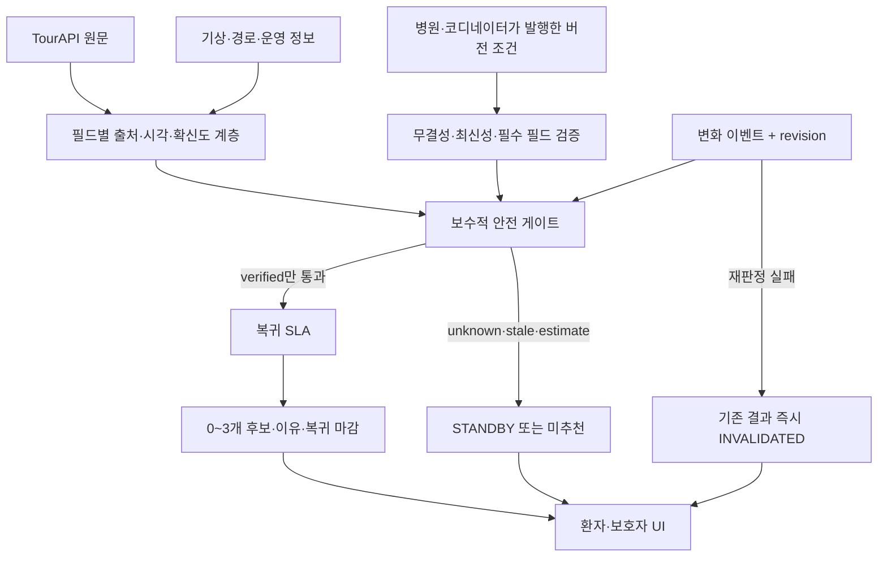

<!-- /autoplan restore point: /Users/macddiwoo/.gstack/projects/kojaecheon-safehour/docs-AX-011-preimplementation-review-autoplan-restore-20260801-191007.md -->
# SafeHour 개발 착수 전 통합 계획

- 작업 ID: AX-011
- 상태: DESIGN_REVIEW
- 기준일: 2026-08-01
- 기준 커밋: `0a192f1`
- 목표: 기능 구현을 시작하기 전에 제품·디자인·엔지니어링·개발경험·운영 전제를 검증하고, 착수 가능한 작업과 사람 결정이 필요한 차단 항목을 분리한다.

## 연결 문서

- 제품·정책 정본: Notion `기획산출물_v1.0 - SAFEHOUR` D01–D09 (`WORKING`)
- 실행 규칙: `docs/AX_WORKFLOW.md`
- 현재 증거: `docs/DEVELOPMENT_READINESS.md`
- 우선순위 작업: `docs/AX_BACKLOG.md`
- 구현 방향: `docs/IMPLEMENTATION_DIRECTION.md`

## 현재 사실

- 규칙 기반 판정 엔진, TourAPI 연동, 추천·재계산 API, 모바일 웹 프로토타입이 존재한다.
- `npm run check`가 로컬과 GitHub Actions에서 통과한다.
- 현재 작업 트리 기준 자동 테스트는 84개이며 `npm run check`가 통과한다. 제한된 커버리지 명령의 line coverage는 82.14%다.
- 저장소는 `kojaecheon/safehour` 비공개이며 `main` 기준선이 존재한다.
- 현재 구현에는 SCR006 장소 상세, 핵심 E2E, 실기기·axe 검증, 배포·rollback 증거가 없다.
- D01–D09는 사람 승인 전 `WORKING`이며 구현이 존재한다는 이유로 승인 상태를 올릴 수 없다.

## 제품 전제 후보

1. 병원의 최신 주의조건과 복귀시간을 구조화하면 일반 관광 앱보다 안전한 선택 제한이 가능하다.
2. 사용자는 추천보다 설명 가능한 미추천과 정시 복귀를 가치로 받아들인다.
3. 현재 GPS를 서버에 전송하지 않고 사용자가 선택한 고정 기준점만으로 핵심 시연이 가능하다.
4. 규칙 기반 결정론적 엔진이 의료 인접 안전 판정과 심사 증명에 적합하다.
5. 환자와 보호자의 서로 다른 시간·동행 제약을 하나의 서비스 안에서 다룰 가치가 있다.
6. TourAPI와 기상·경로 데이터의 신선도와 품질이 안전한 추천에 필요한 수준으로 확보될 수 있다.
7. 2026-09-18 기능 동결과 2026-09-21 제출 일정 안에 P0 범위를 검증할 수 있다.

## 1차 범위

### 포함

- 사용자가 선택한 병원·숙소 고정 기준점
- 병원이 제공한 외출·금식·동행·실내·자외선·보행·이동·복귀 조건
- NO_TOURISM, STANDBY, SPLIT_NEARBY, TOGETHER 판정
- TourAPI 국문·영문·무장애 후보와 영문 폴백
- 추천 3개, 제외 이유, 출발 마감, 출처·불확실성
- 휴무·날씨·교통·진료시간·환자 호출 후 재판정
- 모바일 웹 핵심 흐름과 즉시 복귀 안내

### 제외

- 증상 해석·회복일차 진단·의료적 외출 허가
- 병원 목록·순위·추천·알선
- 현재 GPS와 위치 이력
- 네이티브 앱
- 확인되지 않은 자동번역·영업·실내·접근성 단정
- 위치정보 검토 전 실제 Directions 연동

## 착수 전 작업 순서

1. AX-002 내부 API schema·오류 계약 고정
2. AX-003 `/plan` 통합 화면 유지 여부와 SCR006 라우트 ADR
3. AX-006 호출 한도·부분 실패·stale 캐시 경계 테스트
4. AX-009 TourAPI client·candidate service 안전 경로 테스트 보강
5. AX-005 SCR006 장소 상세 구현
6. AX-004 입력→추천→변화→복귀 핵심 E2E
7. AX-102 접근성·반응형·실기기 검증
8. AX-007 기상 실API 증거
9. AX-105 배포·feature flag·kill switch·rollback
10. AX-203 기능 동결·제출 리허설

## 사람 결정 트랙

- Project key `safehour`, RACI, 최종 승인자
- 사용자 인터뷰와 KPI 목표값
- Figma file/node/version/owner와 디자인 토큰
- 기준점 검색·지도·Directions 공급자와 위치정보 사전검토
- PlanningInput·조건·판정로그·분석 이벤트의 보존·파기·동의
- 의료·개인정보·위치정보·법무·콘텐츠 Signoff 담당자
- 외부 API timeout·retry·cache·circuit breaker 수치
- 실제 복귀 SLA 버퍼 현장값

## 성공 기준

- 위험 추천 0건, 확인된 복귀 SLA 위반 0건
- 결과 변경이 필요한 지원 이벤트의 `hasVisibleChange=true` 100%
- D09 AC001–AC020에 자동·수동 증거와 검증자·시각 연결
- 360px 핵심 흐름, 키보드, 200% 확대, axe, 실기기 통과
- 현재 GPS 요청·병원 알선·의료 판단·비밀정보 노출 0건
- 배포·canary·kill switch·rollback 리허설 증거
- D09-RG001–RG008 통과, HOLD001–HOLD008 0건, 사람 승인 완료

## 리뷰 목표

이 계획은 아래 질문에 답한 뒤에만 `READY_FOR_IMPLEMENTATION`으로 바꾼다.

1. 해결할 문제와 사용자 가치의 전제가 충분히 검증됐는가?
2. P0 범위가 공모전 성공에 필요한 최소 완결성을 갖는가?
3. UI 상태·콘텐츠·접근성 계약이 구현자가 추측하지 않아도 될 정도로 구체적인가?
4. API·상태·보안·개인정보·실패 경로와 테스트 계획이 닫혀 있는가?
5. 외부 의존성과 사람 결정의 담당자·기한·fallback이 있는가?
6. 개발자가 5분 안에 로컬 기준선을 실행하고 실패 원인을 찾을 수 있는가?

## Phase 1 · CEO/제품 전제 리뷰

### 판정

현재 원안으로 긍정 추천 기능 구현과 공개 시연을 시작하는 것은 **NO-GO**다. 다만 범위를 아래의 **안전 증거 우선 P0**로 고정하고, 핵심 제품 전제를 사람이 확인하면 디자인·엔지니어링·DX 계획 검토는 계속할 수 있다.

- 기능 구현: HOLD
- 계획·계약·검증 준비: CONDITIONAL GO
- 실사용 출시: NO-GO
- D01–D09: 계속 `WORKING`
- 다음 게이트: 제품 전제에 대한 사람 확인

이 판정은 구현량 부족 때문이 아니다. 현재 코드가 `unknown`, `stale`, 추정값을 표시하면서도 일부 경로에서는 긍정 추천을 허용하는 근거로 사용하기 때문이다. 테스트 84개와 녹색 CI는 현재 계약의 일관성을 증명하지만, 계약 자체의 안전성을 증명하지는 않는다.

### 제품 전제 판정

| 전제 | 판정 | 근거 | 다음 증거 |
| --- | --- | --- | --- |
| 병원 조건을 구조화하면 선택을 제한할 수 있다 | CONDITIONAL | 결정론적 게이트는 재사용 가능하지만 현재 입력은 병원 발행물이 아니라 사용자가 선택·입력한 자기신고다. | 병원/코디네이터 역할 인터뷰, 데모 입력과 실발행 입력의 명확한 분리 |
| 설명 가능한 미추천과 정시 복귀가 사용자 가치다 | UNSUPPORTED | 사용자 인터뷰, 이해도 지표, KPI 목표값이 없다. | 환자·보호자·코디네이터 각 3–5명 문제/이해도 인터뷰 |
| 현재 GPS 없이 고정 기준점으로 핵심 시연 가능 | SUPPORTED, 정적 증거 한정 | UI에는 geolocation 호출이 없고 고정 기준점 흐름이 존재한다. API 경계와 네트워크 E2E 증거는 미완료다. | `CURRENT_GPS` 명시 거부 계약 + 브라우저 네트워크/GPS 호출 0 E2E |
| 규칙 기반 결정론적 엔진이 적합하다 | CONDITIONAL | 상태·이유코드·회귀성은 강점이나 정책값과 입력 provenance가 미승인이다. | 버전된 정책 profile, 골든 안전 시나리오, 사람 승인 |
| 환자와 보호자 흐름을 하나의 서비스에서 다룰 가치가 있다 | UNSUPPORTED | 구현은 있으나 핵심 사용자와 의사결정자가 확인되지 않았다. | 역할별 JTBD와 분리 활동 허용 주체 확인 |
| TourAPI·기상·경로 데이터가 안전 추천에 충분하다 | UNSUPPORTED | 운영 여부·실내·보행·경로 증거가 불충분하고 휴리스틱/폴백이 긍정 판정에 쓰인다. | 필드별 provenance·신선도 계약과 검증된 데이터만 쓰는 골든셋 |
| 9월 제출 일정 안에 P0를 검증할 수 있다 | CONDITIONAL | 원안은 과다하며 안전 증거 우선 P0로 축소할 때만 가능하다. | 8/7 전제 결정, 8/14 계약 동결, 9/15 기능 동결 |

### 독립 리뷰 합의

두 독립 CEO 리뷰는 다른 모델·관점으로 순차 실행했고, 다음 5개 핵심 항목에 모두 동의했다.

1. 병원 조건의 진위·완전성이 보장되지 않고 누락값이 허용 방향으로 바뀐다.
2. TourAPI 휴리스틱과 `unknown` 값이 안전 사실처럼 긍정 판정에 사용된다.
3. 직선거리 기반 폴백 이동시간이 최종 복귀 SLA 승인에 사용된다.
4. 재계산 실패 또는 필요한 변화 누락 시 기존 코스를 즉시 무효화하지 않는다.
5. 의료·운영 승인이 없는 유효기간·기상·SLA 수치가 코드 정책으로 고정돼 있다.

추가로 독립 리뷰는 API 경계의 GPS 강제 변환을, Codex 리뷰는 `openNow=null` 추천·금지된 raw fixture·서명 없는 재계산 payload를 별도 중대 위험으로 확인했다. 이견은 결론이 아니라 P0 데이터 전략에서만 있었다. 합성 스냅샷 전용과 strict live-data 중, 일정·안전·가역성을 함께 만족하는 결합안을 권고안으로 채택한다.

### 코드·증거에서 확인한 P0 착수 차단

| ID | 심각도 | 차단 항목 | 관찰된 증거 | 착수 전 계약 |
| --- | --- | --- | --- | --- |
| GATE-P0-01 | CRITICAL | 병원 조건 누락이 허용값으로 승격 | `normalizeCondition`은 `outingAllowed` 누락을 `true`, 여러 누락값을 `false`, 알 수 없는 발행자를 `medical_staff`로 바꾼다. 미래 `issuedAt`도 최신으로 통과한다. | 안전 필드 strict tri-state, 누락/미래/잘못된 타입 거부, 발행 주체와 데모 입력 분리 |
| GATE-P0-02 | CRITICAL | GPS 금지가 경계에서 거부가 아닌 변환 | `normalizeOrigin`은 요청의 `kind`를 검사하지 않고 `USER_SELECTED_FIXED`로 덮어쓴다. | 명시적 `CURRENT_GPS` 400 거부, 현재 GPS 필드 요청 자체 금지, 네트워크 E2E |
| GATE-P0-03 | CRITICAL | 운영 여부 불명이 추천 가능 | mapper는 `openNow=null`을 만들고 candidate gate는 `false`만 차단한다. 기존 실데이터 증거도 `null`인 상태에서 추천 3건을 기록했다. | 긍정 추천은 `openNow=VERIFIED_OPEN`과 만료시각이 있어야 함 |
| GATE-P0-04 | CRITICAL | 실내·UV·식음·보행 휴리스틱이 안전 사실화 | 콘텐츠 유형으로 `indoor=true`, `uvExposed=false`, `hasFood=false`, 보행분을 만들고 엔진이 이를 게이트에 사용한다. | `sourceValue`, `estimateValue`, `confidence`, `observedAt`, `expiresAt` 분리; estimate는 긍정 게이트 금지 |
| GATE-P0-05 | CRITICAL | 폴백 이동시간이 SLA 승인에 사용 | 직선거리 계수·평균속도 기반 결과가 `travelTime.estimate`로 최종 SLA를 통과시킨다. | 검증된 경로 또는 사람이 승인한 만료 스냅샷만 긍정 SLA 승인; 그 외 STANDBY |
| GATE-P0-06 | CRITICAL | 재계산 실패 뒤 기존 결과 유지 | UI는 API/네트워크 오류 메시지만 추가하고 기존 session·카드를 그대로 보여준다. | `INVALIDATED` 상태, 카드 제거, 복귀/재입력만 허용, 세션에도 원자 반영 |
| GATE-P0-07 | HIGH | 필수 변화 누락을 성공으로 표시 | `hasVisibleChange=false`면 UI가 기존 코스가 계속 충족한다고 단정한다. | 이벤트별 `changeRequired` 계약, 필요한 변화가 없으면 kill switch/INVALIDATED |
| GATE-P0-08 | HIGH | 의료·현장 승인 없는 정책값 | 조건 24시간, 최소 창 45분, 환자 10분, 교통 25%, 기상 0/31℃ 등이 코드에 고정돼 있다. | 버전된 `WORKING` policy profile과 승인자·근거·만료일 분리 |
| GATE-P0-09 | HIGH | 병원 조건이 실제 발행물처럼 표현 | UI가 version을 `web-*`로 만들고 사용자가 발행자를 선택한다. | 공모전에서는 `시뮬레이션 조건`으로 표시; 실사용 주장은 병원 발행·무결성 이후만 허용 |
| GATE-P0-10 | HIGH | raw 의료 문구가 fixture에 존재 | 테스트 fixture에 수술 후 회복일차와 병원 안내 원문이 있다. | 합성·비의료·비식별 fixture로 교체하고 secret/PII/content scan 추가 |
| GATE-P0-11 | HIGH | AX-002가 잘못 완료 선언됨 | 새 API 문서는 permissive 변환을 v1 정본으로 선언하고 백로그는 완료로 바뀌었다. | 구조 계약과 미승인 정책을 분리하고 AX-002를 재검토 상태로 환원 |
| GATE-P0-12 | HIGH | 배포 런타임과 호출 제어 미결정 | TourAPI cache/counter/log는 동기 로컬 파일과 비원자적 read-modify-write를 사용한다. | 배포 ADR 후 외부 저장소 또는 완전 무상태 데모 모드 결정 |

### 문제 재정의

SafeHour의 핵심 가치는 “의료관광 추천”이 아니라 다음의 증명이다.

> 병원에서 받은 제약과 복귀 마감을 위반할 가능성이 있거나 근거가 불확실하면 추천하지 않고, 조건이 변하면 기존 결과를 폐기한 뒤 이유를 설명하는 제약 증명 시스템.

이 정의는 일반 관광 앱·병원 매칭·회복 조언 플랫폼과 경쟁하지 않는다. 기존 의료관광 제품들은 병원·여정·애프터케어를 한곳에 묶는 방향이 많지만, SafeHour는 **추천을 줄이는 능력과 근거의 증명**으로 차별화해야 한다. WHO의 환자안전 관점도 disclaimer보다 시스템·프로세스 설계를 강조하며, 한국의 외국인환자 유치 규제는 향후 병원 추천·알선·수수료 기능을 범위 밖에 유지할 이유를 강화한다.

참고:

- WHO Patient Safety: https://www.who.int/news-room/fact-sheets/detail/patient-safety
- VisitKorea Medical Tourism: https://english.visitkorea.or.kr/svc/contents/infoHtmlView.do?vcontsId=137714
- 의료 해외진출 및 외국인환자 유치 지원에 관한 법률: https://www.law.go.kr/LSW/lsInfoP.do?lsiSeq=279693

### Dream state



### 현실적 P0 대안

| 대안 | 내용 | 장점 | 위험 | 일정 적합도 |
| --- | --- | --- | --- | --- |
| A. 안전 증거 우선 데모 | 사람 검증·만료된 합성 골든셋만 긍정 판정. live TourAPI는 콘텐츠와 provenance 시연용이고, 필수 안전 사실이 모두 검증된 경우에만 별도 strict mode에서 통과 | 안전 메시지가 가장 선명하고 재현 가능 | 실제 live 추천처럼 보이지 않도록 데모 라벨 필요 | 높음 |
| B. Strict live-data 데모 | TourAPI를 유지하되 운영·실내·보행·경로 중 하나라도 미확인이면 제외 | 실제 데이터 연결을 보여줌 | 추천 0건이 빈번하고 외부 품질에 일정이 종속 | 중간 |
| C. 단일 병원 파일럿 | 병원 발행 조건·수동 검증 후보·실경로 연결 | 실제 가치 검증에 가장 좋음 | 병원 파트너·의료·법무가 외부 임계경로 | 낮음 |

**권고: A를 기본 모드로 채택하고 B는 증거가 충족될 때만 작동하는 선택적 strict mode로 둔다.** C는 공모전 제출 후 별도 validation 단계로 미룬다.

### 선택적 범위 확장 결정

CEO 리뷰는 기능 수를 늘리는 확장을 채택하지 않았다. 안전 증거를 완결하는 다음 세 항목만 P0에 추가한다.

- 채택: 필드별 provenance·confidence·observedAt·expiresAt 계약
- 채택: `INVALIDATED` 또는 동등한 실패 무효화 UI/상태 계약
- 채택: revision 기반 최신 재계산 응답만 적용하는 계약
- 보류: 병원 발행 토큰/HMAC·EHR 연동 — 단일 병원 파일럿 전제
- 보류: 실제 Directions — 위치정보·공급자 승인 전제
- 제외: AI 개인화·병원 매칭·네이티브 앱·광범위 analytics

### P0 범위

#### 포함

- 공모전용임을 명시한 시뮬레이션 병원 조건
- strict 입력 schema와 모든 안전 필드의 명시 상태
- 사람 검증·만료시각이 있는 골든 후보 스냅샷
- live TourAPI 원문·다국어·출처 연결 시연, 안전 사실과 분리
- NO_TOURISM, STANDBY, SPLIT_NEARBY, TOGETHER와 실패 무효화 상태
- 최대 3개 후보, 0개 정상 결과, 제외 이유, 복귀 마감
- 휴무·진료 앞당김·환자 호출의 revision 재판정
- 모바일 웹 핵심 흐름, 즉시 복귀, E2E·접근성·rollback 증거

#### 추가 범위 밖

- 실제 환자 대상 공개 서비스
- 3개 추천 강제
- 미확인 live 데이터를 사용한 긍정 추천
- 전체 SCR006 상세 페이지가 일정의 핵심 경로가 되는 것; 카드/시트 provenance로 먼저 증명
- 실제 실시간 이벤트 공급자 전부 연결
- 관리자 대시보드, 병원/EHR 연동, 서명 토큰

### Error/Rescue Registry

| 실패 | 사용자에게 보일 상태 | 복구 행동 | 자동 검증 |
| --- | --- | --- | --- |
| 병원 조건 없음·unknown·미래·만료 | NO_TOURISM | 최신 조건 재확인 | strict schema + 골든 테스트 |
| 조건 상충 | NO_TOURISM | 병원 발행 주체에게 확인 | 충돌 조합 테스트 |
| `CURRENT_GPS` 또는 GPS류 필드 | 요청 거부 | 고정 기준점 선택 | API + 네트워크 E2E |
| 후보 운영 여부 불명·만료 | 후보 제외 | 다른 verified 후보 또는 STANDBY | provenance fixture |
| 실내·UV·식음·보행 필수 사실 불명 | 후보 제외 | verified 자료 확인 | unknown matrix |
| 경로 데이터 없음·만료 | STANDBY | 승인 스냅샷 또는 재확인 | SLA source 테스트 |
| 기상 데이터 없음 | 영향 범위에 따라 실외 제외/verified 실내만 유지 | 재조회 또는 STANDBY | policy profile 테스트 |
| TourAPI 429·5xx·빈 결과 | STANDBY | 만료되지 않은 승인 스냅샷 또는 재시도 | fixture 테스트 |
| 재계산 4xx·5xx·network | INVALIDATED | 기존 카드 숨김, 재입력/복귀 | UI E2E |
| 필수 이벤트인데 변화 없음 | INVALIDATED/kill switch | 기존 결과 폐기 | `changeRequired` 테스트 |
| 구 revision 응답 도착 | 사용자 변화 없음 | 응답 폐기 | race E2E |
| sessionStorage 유실·만료 | 결과 없음/재입력 | 새 판정 생성 | reload/time-travel E2E |
| quota/cache/log 저장 실패 | STANDBY | 무상태 골든셋 모드 | 배포 fixture/canary |
| 이미지·번역·출처 불명 | 콘텐츠 숨김/원문 표시 | 검수된 원문만 사용 | 콘텐츠 계약 테스트 |

### 주요 실패 모드

1. 안전 필드 누락을 false 또는 true로 만들어 추천한다.
2. 공급자 원문과 SafeHour 추정을 같은 논리 필드로 사용한다.
3. `modifiedtime`을 영업·안전 신선도로 오해한다.
4. 폴백 이동시간이 실제보다 짧아 복귀 SLA를 잘못 통과시킨다.
5. 이벤트 재판정 실패 뒤 사용자가 이전 카드를 계속 따른다.
6. 오래된 결과를 sessionStorage reload로 다시 본다.
7. 동시에 도착한 구 재판정 응답이 최신 결과를 덮는다.
8. 공개 API 남용이 TourAPI quota를 소진한다.
9. 서버리스에서 로컬 파일 counter/cache가 유실·경합한다.
10. 데모 이벤트를 실제 실시간 공급자 이벤트처럼 오인하게 한다.
11. “안심”, “안전”, “1순위” 문구가 증거보다 강한 보장을 암시한다.
12. 병원 관계·홍보·수수료가 추가돼 병원 알선 경계를 넘는다.

### 성공 지표 재정의

기존 테스트 수와 커버리지는 보조 지표로만 쓴다. 제품·안전 성공은 다음 지표의 정의와 평가 집합이 먼저 있어야 한다.

- 골든 안전 시나리오 false-positive 추천 0건
- `unknown`/`stale`/`estimate`가 긍정 안전 게이트를 통과한 건수 0
- 재계산 실패 후 기존 추천 카드 노출 0
- 구 revision 응답 적용 0
- 현재 GPS API·브라우저 요청·제3자 전송 0
- 사용자 이유·복귀 마감 이해도: 목표값은 인터뷰 후 사람이 승인
- 추천 없음 결과를 이해하고 우회하지 않은 비율: 목표값은 인터뷰 후 사람이 승인
- 입력부터 결정 이해까지 시간·이탈률: 목표값은 인터뷰 후 사람이 승인

### 일정 교정

2026-08-01부터 9월 18일까지 48일, 제출일까지 51일이다. 제출 당일 리허설은 실패 복구 시간이 없으므로 금지한다.

| 기한 | 게이트 |
| --- | --- |
| 8/7 | P0 대안, 핵심 사용자, 병원 조건 권위 모델, RACI 확인 |
| 8/14 | fail-closed schema, provenance, 골든 시나리오, `WORKING` policy profile 동결 |
| 8/28 | P0 기능 코드 완료 목표 |
| 9/6 | 핵심 E2E, GPS 0, 접근성, 보안, 배포·rollback 완료 |
| 9/11–14 | 의료·개인정보·위치정보·법무·콘텐츠 검토와 제출 리허설 |
| 9/15 | 기능 동결 |
| 9/18 | 증거·문구·제출 패키지 동결 |
| 9/19–20 | 최종 패키지 확인과 예비 제출 |
| 9/21 | 제출만 수행 |

### 사람이 승인해야 하는 전제

1. SafeHour P0가 실사용 서비스가 아니라 공모전용 안전 제약 데모인가?
2. 병원 조건을 P0에서는 `시뮬레이션 입력`으로 명시하는가?
3. 긍정 추천은 사람 검증·만료시각이 있는 골든 스냅샷만 허용하는가?
4. live TourAPI는 원문·다국어·출처 시연에 쓰고, 검증되지 않은 안전 속성은 허용 근거로 쓰지 않는가?
5. unknown·stale·estimate는 긍정 사실이 아니며 필요한 증거가 없으면 후보 제외 또는 STANDBY인가?
6. 공모전 후 다음 단계는 일반 공개 서비스가 아니라 단일 병원 파일럿 검증인가?

위 여섯 항목은 하나의 제품 방향 묶음이다. 사람 확인 전에는 Phase 2 디자인 리뷰로 넘어가지 않는다.

**Premise Gate 결과:** 2026-08-01 사용자 승인 완료. 승인 범위는 위 여섯 항목의 공모전용 `안전 증거 우선 P0` 방향이다. D01–D09의 정책 수치, 의료·개인정보·위치정보·법무·콘텐츠 승인 또는 `WORKING` 상태 변경을 의미하지 않는다.

### Phase 1 완료 요약

```text
+====================================================================+
| CEO REVIEW — COMPLETION SUMMARY                                    |
+====================================================================+
| Mode                | SELECTIVE EXPANSION                           |
| System audit        | 엔진·API·UI·TourAPI·테스트·문서·Git·CI 검토  |
| Premises            | 1 supported, 3 conditional, 3 unsupported     |
| Critical gaps       | 6                                             |
| High gaps           | 6                                             |
| Error paths mapped  | 14                                            |
| Failure modes       | 12                                            |
| Scope proposals     | 6 proposed, 3 accepted, 2 deferred, 1 skipped |
| Independent voices  | 2 sequential reviews, core verdict aligned    |
| NOT in scope        | written                                       |
| Dream state         | written                                       |
| Unresolved decision | product premise bundle                        |
| Verdict             | NO-GO until premise gate                      |
+====================================================================+
```
