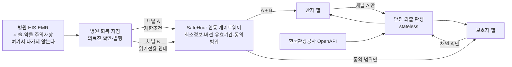

# SafeHour 기능정의서 — 회복 동행 플랫폼 (v2)

- 기준일: 2026-08-14
- 상태: **정의 초안.** 목표 제품을 정의하며, 구현 현황은 `docs/DEVELOPMENT_READINESS.md` 가 소유한다.
- 연결: D01 제품 목표, D02 시나리오, D04 API·데이터, D07 정책, ADR-0003
- v1 대비 변경: 회복 카드가 시술·약물 원천정보를 담는 설계를 **철회**하고,
  병원이 확정한 **제한조건 + 읽기 전용 안내**만 받는 구조로 바꿨다 (§2).

> **제품 정의**
> SafeHour 는 시술 후 관광 추천 앱이 아니다.
> **병원이 발행한 회복 지침을 환자와 보호자가 함께 확인하고, 지침을 지킬 수 있을 때만
> 안전한 외출 선택지를 제공하는 회복 동행 플랫폼**이다.

---

## 1. 구조 확정

**시술·약물 원천정보는 병원이 보유하고, SafeHour 에는 병원이 확정한 제한조건과 읽기 전용
안내만 전달한다.** 이 구조로 확정한다.

v1 의 설계(시술 분류 코드·약물명·금지 음식군을 앱이 받아 규칙으로 적용)는 폐기한다. 이유:

| v1 의 문제 | 확정 구조에서 |
| --- | --- |
| "이 약을 먹으니 이 음식을 피하라" 를 앱이 판단 → **의료행위 경계 침범** | 병원이 판단하고 결과만 발행 |
| 시술명·약물명을 앱이 보유 → 민감정보 등급이 최고로 올라감 | 제한조건 대부분은 **행동 제약**이라 등급이 낮다 |
| 병원마다 다른 시술 분류 체계를 앱이 표준화해야 함 | 병원이 자기 체계로 판단하고 **공통 제한조건**만 내보낸다 |
| 규칙이 틀리면 앱의 책임 | 판단 주체·시각·버전이 발행 기록으로 남는다 |

---

## 2. 경계 — 두 개의 채널

확정 구조를 정확히 구현하려면 **"재해석하지 않는다" 와 "보유하지 않는다" 를 구분**해야 한다.
약물 안내를 화면에 띄우는 것만으로도 건강정보 처리다. 그래서 병원이 보내는 것을 성격이
다른 두 채널로 나눈다.

| | **채널 A — 제한조건** | **채널 B — 병원 안내문** |
| --- | --- | --- |
| 형태 | 기계가 읽는 코드값·수치 | 사람이 읽는 문장 (병원이 쓴 그대로) |
| 예 | `외출허용=true`, `보행한도=20분`, `복귀마감=18:00`, `동행필수=false`, `자외선제한=true`, `복약시각=[09:00,15:00,21:00]` | "샤워는 3일 뒤부터", "매운 음식과 술은 2주간 피하세요", "처방된 항생제를 식후 30분에" |
| 판정에 쓰이나 | **쓰인다** (안전 게이트·SLA 입력) | **절대 쓰이지 않는다** |
| 서버로 가나 | 간다 (비식별 코드값, stateless 계산 후 폐기) | **가지 않는다.** 단말 표시 전용 |
| SafeHour 가 해석하나 | 아니오 — 그대로 적용 | 아니오 — 그대로 출력 |
| 민감정보 등급 | 낮음 (행동 제약) | **높음** (약물·시술 정황이 문장에 담긴다) |

### 이 분리가 만드는 규칙

> **판정에 쓰려면 병원이 채널 A 로 발행해야 한다.**
> 채널 B 의 문장을 파싱해 판정에 쓰는 것은 금지한다 — 그것이 곧 재해석이다.

이 한 줄이 v1 에서 애매하던 두 기능을 정리한다.

| 기능 | v1 | 확정 구조 |
| --- | --- | --- |
| **식이** | 금지 음식군을 앱이 받아 음식점 필터링 | 병원이 `식음제한=true` 또는 `금식종료=HH:MM` 을 **채널 A** 로 발행하면 식음 활동을 제외한다. "매운 음식 주의" 같은 문장은 **표시만** 하고 필터링에 쓰지 않는다 |
| **복약** | 약물명·용법을 받아 알림·SLA 반영 | **복약 시각만** 채널 A 로 받는다. 무슨 약인지 알 필요가 없다 — SLA 계산에는 "15:00 까지 돌아와야 한다" 는 시각만 있으면 된다. 약물 안내문은 채널 B 로 표시 |

**복약이 특히 깔끔해진다.** `복약시각=[15:00]` 하나면 외출 창을 자르는 중간 마감으로 쓸 수
있고, 약물명은 서버 근처에 갈 이유가 전혀 없다.

---

## 3. 아키텍처



### 게이트웨이의 책임

| 책임 | 내용 |
| --- | --- |
| **최소화** | 병원이 보낸 것 중 제한조건과 안내문만 통과시킨다. 진단명·시술기록·전체 약물목록은 게이트웨이에서 차단 |
| **동의 범위 적용** | 보호자에게는 **동의 범위대로 축약된 payload 를 따로 발행**한다 (§6) |
| **버전·유효기간** | 계획 버전, 발행·수정 시각, 유효기간, 철회 여부를 부여 |
| **어댑터** | 병원마다 다른 인터페이스를 공통 계약으로 흡수 (§10) |

**보호자 축약은 게이트웨이가 한다** — 환자 앱이 받은 뒤 필터링해 보여주는 방식이면
데이터는 이미 넘어간 것이라 정보 분리가 성립하지 않는다. 이것은 아키텍처 요구사항이다.

---

## 4. 데이터 계약 — 회복 지침 (Recovery Plan)

### 4.1 공통 메타 (모든 카드에 붙는다)

| 항목 | 용도 |
| --- | --- |
| 발행 병원·발행자 역할 | "병원에서 제공한 안내" 배지의 근거 |
| 발행 시각 / 최종 수정 시각 | 신선도 표시 |
| 계획 버전 | 새 버전 여부 판단 |
| 유효기간 | 만료 시 외출 차단 (§7) |
| 확인 완료 상태 | 사용자가 이 버전을 읽었는가 |
| 철회 여부 | 병원이 계획을 거둬들였는가 |

### 4.2 채널 A — 제한조건

| 그룹 | 항목 | 현재 |
| --- | --- | --- |
| 외출 | 외출 허용 여부, 실내 한정 | 있음 (수기) |
| 이동 | 최대 보행시간, 최대 편도 이동시간 | 있음 (수기) |
| 환경 | 자외선 제한, 열 노출 제한(사우나·찜질), 수중 활동 금지 | 부분 (자외선만) |
| 동행 | 동행 필수 여부, 보호자 분리 허용 여부 | 있음 (수기) |
| 식음 | 식음 활동 제한 여부, 금식 종료 시각 | 부분 (boolean) |
| 시간 | 복귀 마감 시각, 복약 시각 목록, 다음 진료 일시 | 부분 (복귀만) |
| 상태 | 환자 호출 플래그 | 있음 (이벤트) |

**모두 코드값·수치·시각이다.** 자유 서술은 채널 A 에 들어오지 않는다.

### 4.3 채널 B — 병원 안내문

활동·외출 / 복약 / 음식·음료 / 생활(세안·목욕·자외선) / 동행 / 이상 상황 대응 / 다음 진료.

**표시 규칙**

- 병원 원문과 SafeHour 문구를 **시각적으로 분리**한다 (지금 장소 상세에서 TourAPI 원문과
  추정값을 분리하는 것과 같은 방식)
- 각 카드에 "병원에서 제공한 안내" 배지 + 발행·수정 시각 + 유효기간 + 새 버전 여부 + 확인 상태
- **번역하지 않는다.** 원문 언어를 `lang` 으로 표기하고, 필요하면 병원이 다국어 원문을 함께 발행
- 편집·요약·재배열하지 않는다

---

## 5. 화면 구조

```
[현재]                        [확정]

                             /link        병원 연결 (QR·초대링크·데모)
/           시작              /            시작 → 연결 유도
                             /today       ★ 홈 · 오늘의 회복 상태
                             /guide       병원 회복 안내 (읽기 전용)
/plan       조건 입력          /plan        안전 외출 — 계획 확인 화면으로 교체
/result     판정 결과          /result      판정 결과 · 변화 대응 · 즉시 복귀
/place/{id} 장소 상세          /place/{id}  장소 상세
                             /share       보호자 연결·공유 범위
/privacy    고지              /privacy     고지
```

하단 내비게이션 4영역: **홈 · 회복 안내 · 안전 외출 · 보호자**

### 5.1 개선 — "보호자" 탭의 의미를 좁힌다

제안된 4탭 중 "보호자" 를 **환자 앱 안의 보호자 화면**으로 두면 정보 분리가 무의미해진다.
보호자는 다른 사람이고 다른 기기를 쓴다.

> 환자 앱의 4번째 탭은 **"보호자 연결·공유 설정"** 이다. 보호자가 보는 화면은
> 같은 앱을 **보호자 모드**로 연결했을 때 그 사람의 기기에 뜬다.

### 5.2 개선 — 단일 액션 원칙의 예외

"경고를 반복하기보다 현재 해야 할 행동 하나를 크게" 는 옳지만, 안전 서비스에서는 조건이 붙는다.
미추천 상태에서 "해야 할 행동" 은 "아무것도 하지 않기" 라서 액션이 사라질 수 있다.

> **액션은 사라지지 않고 성격이 바뀐다.**
> 가능 → `안전 외출 확인` · 대기 → `병원 안내 다시 보기` · 불가 → `병원 연락` / `즉시 복귀`

---

## 6. 기능

### 6.1 환자

| ID | 기능 | 현재 |
| --- | --- | --- |
| P-01 | 병원 연결 — QR·초대링크, 발행 병원·역할·유효기간·마지막 동기화 표시 | 없음 |
| P-02 | 홈 대시보드 — 인증 상태 / 오늘 외출 가능·대기·불가 / 다음 복약·주의·예약 / 복귀 마감 / 미확인 업데이트 | 없음 |
| P-03 | 회복 안내 열람 — 7종 카드, 버전·확인 상태 | 없음 |
| P-04 | 안전 외출 — 계획 확인 → 모드 선택 → 기준점·복귀 확인 → 판정 | 있음 (조건 수기) |
| P-05 | 변화 대응 재판정 | **있음** |
| P-06 | 즉시 복귀 | **있음** |
| P-07 | 장소 상세 | **있음** |
| P-08 | 보호자 연결·공유 범위 설정 | 없음 |
| P-09 | 병원 업데이트 확인 | 없음 |
| P-10 | 다국어 | **있음** |
| P-11 | 내 데이터 지우기 | **있음** |

### 6.2 보호자 — 무엇이 보이고 무엇이 안 보이나

| 보인다 | 보이지 않는다 |
| --- | --- |
| 환자와 함께 있어야 하는지 | 상세 진단 |
| 보호자 단독 외출이 허용되는지 | 전체 시술·수술 기록 |
| 언제까지 돌아와야 하는지 | 전체 약물 목록 |
| 병원의 환자 호출 여부 | 공유 동의가 없는 개인 의료정보 |
| 즉시 복귀 방법 | |
| 환자가 공유에 동의한 일정·주의사항 | |

### 6.3 병원

회복 계획 발행·수정·철회 / 외출·동행·복귀 조건 설정 / 환자·보호자 초대 /
환자 화면 미리보기 / 중요 변경 확인 여부 조회 / 연동 성공·실패 기록 / 접근 감사 기록.

> **개선 — 감사 기록의 보관 주체는 병원이다.**
> 감사 로그는 본질적으로 저장이다. SafeHour 서버가 보관하면 "서버 무저장" 원칙이 조용히
> 깨진다. 감사 기록은 **병원 측에 남기고**, SafeHour 는 발행·조회 사실만 병원에 회신한다.

---

## 7. 안전 게이트 재정의

기존 게이트 앞에 **연결 게이트**가 추가된다.

```
[연결 게이트]  유효한 병원 계획이 있는가?
   없음·만료·철회·충돌 → 관광지를 표시하지 않는다
   미확인 중요 변경 있음 → STANDBY 로 강등
        ↓ 통과
[안전 게이트]  기존 로직 (조건·SLA·역할)
        ↓ 통과
[후보 판정]    기존 엔진
```

### 개선 3가지

| # | 지적 | 처리 |
| --- | --- | --- |
| 1 | **외출 중 만료** — 이미 나가 있는 사람에게 "만료됐습니다" 만 띄우면 위험하다 | **구현 완료 (AX-220)** — 진입·만료 타이머·탭 복귀 3시점 감시. 만료·철회 시 추천 무효화 + 복귀 시트 자동 표시 + 시연 패널 차단 |
| 2 | **확인이 형식적 체크가 되는 문제** | 미확인 **중요** 변경(외출·동행·복귀시간·이상대응)이 있으면 판정을 STANDBY 로 강등한다. 확인해야 판정이 풀린다 |
| 3 | **새 사유 코드 필요** | `NO_HOSPITAL_PLAN` `PLAN_EXPIRED` `PLAN_REVOKED` `PLAN_UNCONFIRMED_UPDATE` `MEDICATION_WINDOW` — 기존 `REASON` 체계에 추가 |

병원 업데이트 5종(안내 변경·진료시간 변경·동행 조건 변경·복귀시간 단축·환자 호출)과
계획 만료·철회는 모두 **기존 재판정 파이프라인을 그대로 탄다.** 변화 전후 비교와
"무엇이 바뀌었고 기존 계획에 어떤 영향인지" 는 이미 구현돼 있다.

---

## 8. 개인정보·법적 경계

| 항목 | 확정 구조에서 |
| --- | --- |
| **민감정보 동의** | 채널 B 를 표시하는 것만으로도 건강정보 처리다. **별도 동의 필수** (개인정보보호법 §23). "안 받으니 동의 불필요" 전략은 더 못 쓴다 |
| **제3자 제공** | 병원 → 앱은 진료정보 제공. 환자 동의 + 병원의 근거가 함께 필요 |
| **보호자 공유** | 환자 건강정보를 제3자에게 제공하는 것. 동의 범위가 법적 요건이자 기술 요건 |
| **서버 무저장** | **유지 가능하다.** 채널 A(비식별 코드값)만 판정 요청에 실리고 계산 후 폐기. 채널 B 는 단말을 떠나지 않는다 |
| **위조 방지** | 계획이 판정 근거이므로 서명·유효기간 검증이 안전 요건 |
| **본인 인증** | §9-1 참조 |

### 유지되는 불변조건

의료 판단 미생성 · 계획 없거나 만료 시 미추천 · GPS 미수집 · 병원 알선/순위/평점 금지 ·
원문과 추정값 분리 · 광고·제휴 추천 없음.

---

## 9. 추가 개선 방향

### 9-1. 본인 인증 — 외국인에게 작동하는 방식이어야 한다

"환자가 본인 인증 후 연결" 은 한국 본인인증(PASS·휴대폰)을 전제하면 **대상 사용자에게
작동하지 않는다.** 외국인 환자는 대부분 수단이 없다.

> **권고**: 병원 발급 1회용 코드 + 병원에 등록된 최소 식별자(예: 진료번호 뒤 4자리 또는
> 생년월일) 조합. 인증 주체는 **병원**이고 SafeHour 는 검증만 한다.
> 본인인증 사업자 연동은 대안이 아니라 **오히려 진입 장벽**이다.

**확정 (2026-08-14 · ADR-0004)**: 계정 인증은 **소셜 로그인(Google·Kakao)** 으로 한다.
다만 로그인이 보장하는 것은 "같은 계정이 다시 왔다" 뿐이고, **"이 사람이 그 환자다" 는
병원 발급 코드가 확인한다.** 둘은 다른 층위이며 화면과 고지에 그렇게 명시했다.
Google 이 환자의 주 경로, Kakao 는 한국인 보호자·코디네이터 경로다.

### 9-2. FHIR 은 목표, 첫 파일럿은 전용 어댑터

CarePlan · Consent · Provenance · AuditEvent 매핑은 정확하고 SMART App Launch 의 scope 제한도
맞다. 다만 현실 점검이 필요하다.

- 타깃은 **의원급 성형외과·피부과**다. 대형병원 EMR 이 아니라 의원급 전자차트를 쓴다
- 이 계층의 FHIR API 지원률은 낮다. 없을 가능성이 더 높다
- 따라서 **첫 파일럿은 병원 전용 어댑터(웹 발행 폼 / CSV / 전용 API)** 로 잡고,
  FHIR 은 게이트웨이 뒤의 어댑터 하나로 둔다

게이트웨이가 어댑터 패턴인 것이 이 현실을 흡수한다. **적용 버전과 프로파일은 연동 병원의
HIS 지원 범위를 확인한 뒤 결정한다.**

### 9-3. 수기 입력을 없애고 데모 모드로 대체한다 (v1 철회)

v1 은 수기 입력(L0)을 영구 폴백으로 두자고 했다. **철회한다.**

수기 입력이 남아 있으면 "환자가 한국어 안내문을 해석한다" 는 결함이 그대로 남고,
제품 메시지가 흐려진다. "연결되지 않거나 만료되면 외출 추천 차단" 이 옳다.

다만 **심사위원이 병원 연동 없이 서비스를 눌러봐야 한다.** URL 을 열었을 때 "병원 연결
필요" 만 뜨면 구현성 30점을 받을 수 없다.

> **해결: 데모 모드.** 의료진 발행이 완료된 **비식별 회복 계획 fixture** 를 1클릭으로 불러
> 전체 흐름을 체험하게 한다. 실제 연동으로 오인되지 않도록 **화면에 "병원 연동 데모" 를
> 상시 표시**한다.

요강의 "제출 내역이 허위이거나 결격 사유" 조항 때문에라도 이 표시는 선택이 아니다.

### 9-4. 디자인 — 확정된 팔레트와의 충돌

제안된 색 지침(딥블루·딥틸 신뢰색 + 로즈 포인트)은 어제 확정·구현한 **클리닉 프리미엄
(웜 아이보리 + 딥그린 + 골드)** 과 다르다.

| | 현재 구현 | 제안 |
| --- | --- | --- |
| 신뢰색 | 딥그린 `#1F4D3D` | 딥블루·딥틸 |
| 포인트 | 골드 `#C9A227` | 로즈 |
| 바탕 | 웜 아이보리 | 화이트·웜그레이 |

나머지 지침(카드 구성, 병원 확인 배지 상단 고정, 출처 3영역 시각 분리, 광고·순위 없음)은
**현재 구현과 충돌하지 않고 그대로 얹힌다.**

> **권고**: 색은 지금 것을 유지한다. 딥그린도 신뢰색 역할을 하고 있고 axe 9화면 대비 검증을
> 이미 통과했다. 다만 **교체 비용은 낮다** — 토큰 6개만 바꾸면 되고 JSX 변경이 없다.
> 딥틸로 가고 싶으면 말씀만 주시면 된다.

새로 필요한 것은 색이 아니라 **세 번째 출처 구분**이다. 지금은 "TourAPI 원문 / SafeHour 추정값"
2영역인데, 병원 안내문이 들어오면 **병원 원문 / SafeHour 판정 / 관광정보** 3영역이 된다.

### 9-5. 오늘의 상태를 판정 결과와 같은 엔진으로 계산한다

홈의 "오늘 외출 가능·대기·불가" 를 별도 로직으로 만들면 결과 화면과 어긋난다.
**기존 4상태 엔진을 그대로 호출**해 홈에 요약으로 띄우고, 외출 화면은 같은 판정의 상세로 둔다.
판정이 두 벌 생기는 것이 이 제품에서 가장 위험한 결함이다.

---

## 10. 단계별 계획

### 구현 현황 (2026-08-14)

| # | 항목 | 상태 |
| --- | --- | --- |
| 1 | 데이터 계약 + 채널 A/B 분리 | **완료** — `src/recovery/plan.js` |
| 2 | 게이트웨이 + 비식별 fixture | **완료** — `src/recovery/gateway.js` |
| 3 | `/link` + 병원 연동 데모 표시 | **완료** |
| 4 | `/today` 홈 대시보드 | **완료** |
| 5 | `/guide` 읽기 전용 안내 | **완료** |
| 6 | `/plan` 계획 확인 화면 교체 | **완료** (AX-221) — 수기 입력 제거 |
| 7 | 연결 게이트 + 사유 코드 5종 | **완료** — 외출 중 만료·철회 전환 포함 (AX-220) |
| 8 | 지침 변경 시 추천 무효화 | 기존 재판정 파이프라인 재사용 — 연결 필요 |
| 9 | 보호자 축약 payload | **완료** (게이트웨이) — 화면은 미착수 |

### 공모전 버전 (~9/21)

| # | 항목 | 비고 |
| --- | --- | --- |
| 1 | 회복 지침 데이터 계약 + 채널 A/B 분리 ADR | 문서 |
| 2 | 가상 병원 연동 어댑터 + 비식별 fixture | 게이트웨이 계약을 실제로 태운다 |
| 3 | `/link` 연결 화면 + **병원 연동 데모 표시** | 9-3 |
| 4 | `/today` 홈 대시보드 | 9-5 |
| 5 | `/guide` 읽기 전용 안내 (버전·확인 상태) | 채널 B |
| 6 | `/plan` 을 계획 확인 화면으로 교체 | 수기 입력 제거 |
| 7 | 연결 게이트 + 새 사유 코드 5종 | §7 |
| 8 | 지침 변경 시 추천 무효화 | 기존 파이프라인 재사용 |
| 9 | 보호자 축약 payload + 공유 범위 | 게이트웨이에서 분기 |

### 병원 파일럿

병원 인증과 환자 동의 / 병원 전용 어댑터(또는 FHIR) / 계획 버전·유효기간·철회 처리 /
접근 감사(병원 보관)와 데이터 보존 정책.

### 운영 확장

병원별 어댑터 / 다국어 병원 원문 / 보호자 권한 관리 / 실시간 계획 변경 알림.

---

## 11. 기존 코드와의 관계

| 자산 | 확정 구조에서 |
| --- | --- |
| `src/engine/safetyGate.js` | **그대로.** 앞에 연결 게이트만 추가 |
| `src/engine/slaCalculator.js` | 복약 시각·다음 진료를 **추가 마감**으로 |
| `src/engine/recommend.js` | 식음 제한을 채널 A 플래그로 받아 적용 |
| `src/domain/states.js` | 4상태 유지, 사유 코드 5종 추가 |
| `src/tour-api/*` | **그대로** |
| `src/i18n/*` | **그대로.** 채널 B 는 번역 대상이 아니다 |
| `app/globals.css` | **그대로.** 출처 3영역 구분만 추가 |
| `lib/session.js` | 회복 계획을 삭제 대상에 추가 |
| `/plan` | 입력 화면 → **계획 확인 화면** |

새로 만들 것: 게이트웨이 계약과 어댑터, `/link` `/today` `/guide` `/share`,
연결 게이트, 보호자 축약 발행, 병원 발행 도구(데모).

---

## 12. 사람 결정 큐

| 항목 | 왜 |
| --- | --- |
| 채널 A 제한조건 **목록 확정** | 병원이 실제로 발행할 수 있는 범위여야 한다 — 의료진 확인 필요 |
| 민감정보 별도 동의 설계 | 문구·시점·철회 방법 |
| 본인 인증 방식 (9-1) | 병원 발급 코드 + 최소 식별자 조합으로 갈지 |
| 병원 파트너 1곳 | 파일럿과 채널 A 목록 검증에 필수 |
| 보호자 공유 기본값 | "공유 안 함" 을 기본으로 할지 |
| 계획 서명·검증 방식 | 위조된 계획으로 판정하면 안전 사고 |
| 색 팔레트 유지 여부 (9-4) | 딥그린 유지 vs 딥틸 교체 |
| 감사 기록 보관 주체 | 병원 보관으로 확정할지 |
